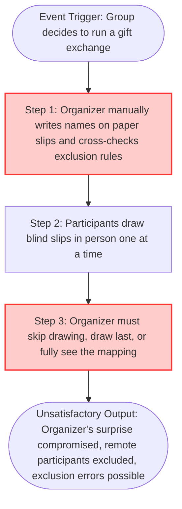

# **📋 Product Discovery Document: Enlaço — Eliminating Organizer-Compromised, Single-Device Gift Exchange Draws**

**Role:** Product Owner / Product Manager

**Objective:** Investigate, map, and deeply understand the customer's core pain points and the current "As-Is" operational friction before designing any technical solution.

**Context:** Enlaço — A Secret Santa / gift-exchange draw SPA/PWA that generates constrained, non-reciprocal random pairings and delivers each result privately to its own participant through independent channels.

## **🏛️ Project Metadata**

* **Client / Segment:** Consumer App — Individuals organizing group gift exchanges (families, companies/coworker groups, friend circles)
* **Date of Creation:** July 7, 2026
* **Lead Product Owner:** Kalyel N. Laurindo / Project Owner
* **Document Version:** v1.0
* **Discovery Input Source:** Direct stakeholder interview (Project Owner acting as domain expert / proxy customer)

## **1. 🎯 The Core Problem (Macro Pain Point)**

### **✍️ Step-by-Step Problem Formulation (Form Entry)**

* **Field 1.1 - Affected Persona(s):** Group Gift-Exchange Organizers (family members, office/HR coordinators, friend-group leaders)
* **Field 1.2 - Operational Bottleneck:** Manually drawing and revealing paper-slip pairings, or running the draw through a website/app displayed on a single shared smartphone passed between all participants
* **Field 1.3 - Frequency & Context:** Every group gift-exchange event (birthdays, office parties, casual meetups), with the heaviest concentration during Carnival and, above all, end-of-year holidays (Christmas/New Year)
  * **Field 1.3.1 - Trigger Frequency:** Transactional (per event)
  * **Field 1.3.2 - Operational Impact Velocity:** Immediate Blocker (the reveal must happen correctly before the gift-exchange date; there is no graceful degradation)
* **Field 1.4 - Direct Negative Impact:** The organizer must either sacrifice their own participation or personally see every pairing to run the draw, breaking the surprise; manually enforcing exclusion rules (e.g., blocking known-incompatible pairs) is error-prone by hand; requiring everyone to view results on the same physical device exposes private matches to bystanders and excludes remote/out-of-town participants entirely.
* **Field 1.5 - Consolidated Macro Pain Statement:** Group gift-exchange organizers across families, offices, and friend groups manually draw and reveal pairings via paper slips or single shared-device apps during every seasonal or social gift-exchange event, which forces the organizer to sacrifice their own participation to preserve secrecy, makes custom exclusion rules unreliable, and exposes private results to bystanders instead of only the intended recipient.

### **❓ Situational Diagnostic Verification**

* **Diagnostic Q1:** *Answer:* The organizer and every participant, at the exact moment the draw is generated and results are revealed — this is a point-in-time social event, not a continuous process.
* **Diagnostic Q2:** *Answer:* No formal enterprise KPIs apply (consumer/social context); degradation surfaces as recurring social friction — participant complaints about "the organizer already knows," forced re-draws when exclusion rules are broken by hand, and remote participants being left out of in-person reveals.
* **Diagnostic Q3:** *Answer:* Groups keep defaulting to paper slips (unreliable exclusion enforcement, organizer always exposed) or quietly abandon the tradition for larger, remote, or hybrid groups (typically up to ~50 people) where in-person single-device reveals no longer scale.

## **2. 👥 Target Audience: Personas, Micro-Pains, and Emotional States**

#### **Persona 1: Group Organizer (Direct User)**
* **Persona Type:** Direct User
* **Department / Area:** N/A (family lead, office/HR coordinator, or friend-group host)
* **Core Operational Micro-Pains:** Must manually track and validate exclusion rules (e.g., "Carlos can't draw Fernando"); has no reliable way to run the draw without seeing results, forcing them to opt out of playing or trust an unverifiable process; must physically coordinate reveal logistics with every participant, including remote ones.
* **Current Emotional Sentiment:** Torn between fairness/inclusion and control; anxious about accidental leaks or a broken draw needing an awkward public re-do.

#### **Persona 2: Participant (Direct User)**
* **Persona Type:** Direct User
* **Department / Area:** N/A (family member, coworker, or friend)
* **Core Operational Micro-Pains:** Depends on the organizer's availability and schedule to learn their own match; must crowd around a single shared device with the rest of the group to see the reveal, losing privacy; has no independent proof the draw wasn't manipulated.
* **Current Emotional Sentiment:** Mildly distrustful ("did the organizer peek?"), impatient for a private, immediate, on-demand reveal.

## **3. 🛠️ Current Workarounds & Shadow IT (Palliative Solutions)**

#### **Workaround 1: Paper Slips**
* **Workaround Type:** Paper-based
* **Operational Process Flow:** Organizer writes every participant's name on a folded slip, manually cross-checks and removes/redraws slips that would violate exclusion rules, then has each participant blindly draw one slip in person.
* **Risk Level:** Medium
* **Systemic Fragility & Data Risks:** Exclusion rules are enforced by hand and easily missed at scale; the organizer sees every name while writing/sorting slips, fully compromising their own surprise; does not support remote participants at all.

#### **Workaround 2: Single Shared-Device Draw Websites/Apps**
* **Workaround Type:** Unofficial Spreadsheets / Shadow IT (generic online "sorteio" tools)
* **Operational Process Flow:** The group opens a generic draw website or app on one phone, which is physically passed from person to person so each can view their own result on the same screen.
* **Risk Level:** High
* **Systemic Fragility & Data Risks:** No real privacy — bystanders routinely see the screen during the handoff; entirely unusable for remote or hybrid (in-person + online) groups; most tools offer no configurable exclusion logic beyond a basic no-self-draw rule.

#### **Workaround 3: Informal Chat Bots (e.g., Telegram Secret Santa bots)**
* **Workaround Type:** Informal Messaging / Shadow IT
* **Operational Process Flow:** A tech-savvy participant sets up a chat-platform bot that runs the draw and DMs each participant their match privately.
* **Risk Level:** Low / Medium
* **Systemic Fragility & Data Risks:** Locked to a single messaging platform's audience (excludes anyone not on that platform); fixed, non-customizable exclusion logic; no shareable web reveal experience or QR-based flow.

## **4. 🚨 Cost of Inaction (COI) / The Penalty of Inertia**

* **Field 4.1 - Operational & Productivity Waste:** No monetary labor cost (consumer/social context); the waste is social capital — organizers spend real personal time manually policing exclusion rules and coordinating reveal logistics every event.
* **Field 4.2 - Quality & Output Damage:** Recurring awkward social outcomes: forced re-draws in front of the group when a paper-slip rule is broken, remote participants excluded from the reveal, or diminished trust in the draw's fairness.
* **Field 4.3 - Compliance, Security & Regulatory Risks:** None applicable — Brazilian raffle-transparency regulation targets for-profit/monetary raffles; Enlaço involves no prize money or purchase requirement, so this legal framework does not constrain the product (validated assumption, not a compliance risk to design around).

## **5. 🔄 Current State Journey (The "As-Is" Workflow)**

### **✍️ Current Systems & Software Infrastructure Involved**

* **System 5.1 - Core Software/Platforms:** Paper and pen; generic single-device "sorteio" websites/apps; WhatsApp/Telegram groups (coordination and, occasionally, bot-driven draws)
* **System 5.2 - Infrastructure Boundaries:** No persistent, individually-addressable delivery layer exists — every current option ties the reveal to either a physical object (paper) or one shared screen

## **6. 💰 Quantitative Pain Metrics & Financial Waste**

* **Field 6.0 - Metric Context:** Consumer App

*Note: Adapted per template guidance — this is a consumer/social context with no direct financial transactions, so financial-waste fields are reframed as engagement/reliability estimates (Fermi-based, since no hard analytics exist yet).*

| Impact Metric | Estimated Value | Unit of Measure | Consequence |
| :--- | :--- | :--- | :--- |
| **Manual Exclusion Rule Errors** | ~10% | Of paper-slip draws requiring a re-draw | Forces a public re-do, breaking the surprise further for the whole group |
| **Reveal Privacy Failures** | ~100% | Of single-shared-device draws | Bystanders see results not meant for them during device handoff |
| **Remote Participant Exclusion** | ~20-30% | Of groups up to 50 people with at least one remote/hybrid member | Remote participants are told results verbally or skipped entirely |
| **Tradition Abandonment** | ~15-20% (estimated) | Of larger/remote groups | Groups quietly stop organizing exchanges due to reveal-logistics friction |

* **Field 6.5 - Primary Target KPI:** 100% automated enforcement of exclusion / no-self-draw / no-reciprocal-pair constraints (0% manual re-draws), and 0% reliance on a single shared device for any reveal.
* **Field 6.6 - Success Verification Method:** Automated constraint-validation checks on every generated draw, plus delivery-channel logs (email sent / WhatsApp link opened / QR scanned) confirming each participant accessed only their own private result.

## **7. 🌱 Root Cause Analysis (The "5 Whys" Framework)**

* **Why 1 (Surface Symptom):** *Response:* Participants and organizers experience recurring friction because the organizer ends up knowing everyone's pairing and can't fully participate.
* **Why 2:** *Response:* Because someone has to manually draw and cross-check the pairings against exclusion rules before anyone can see a result.
* **Why 3:** *Response:* Because no independent, trusted mechanism exists to enforce exclusion rules and generate the draw without a human operator controlling the process.
* **Why 4:** *Response:* Because the generic tools available today (paper, single-device sites, chat bots) conflate draw *generation* and result *reveal* into a single controlled step or screen.
* **Why 5 (True Root Cause):** *Response:* The structural gap is the lack of separation between constrained random draw generation (a solvable algorithmic problem) and individualized, private, multi-channel result delivery (a distribution problem) — every existing workaround forces both into one device or one person's hands.

## **8. 🚧 Problem Boundaries (In-Scope vs. Out-of-Scope Constraints)**

* **Field 8.1 - In-Scope Context:** Web-based (SPA/PWA) draw creation and configuration; configurable pairwise exclusion rules; algorithmic enforcement of no-self-draw and no-reciprocal-pair constraints; an organizer-blind mode allowing the organizer to also participate; private, per-participant result delivery via multiple independent channels (email, WhatsApp link, QR code unlocking an individual web view).
* **Field 8.2 - Out-of-Scope Context:** Physical gift logistics or shipping; native mobile apps (PWA only); enterprise-grade authentication/SSO; in-app group chat or messaging beyond delivering the draw result; monetary/prize-based raffles subject to transparency legislation.

## **9. 🔍 Fallback Channels & Escalation Blockers**

* **Field 9.1 - Help-Seeking Paths:** Today, if a paper draw breaks a rule (duplicate name, violated exclusion), the organizer manually redraws in front of the group, or informally messages the group to redo it.
* **Field 9.2 - Resolution Blockers:** No fallback exists for remote participants who can't join the in-person draw — they are typically told their result verbally by the organizer, which reintroduces the exact "organizer knows/leaks" problem this project exists to remove.

## **🎯 10. Jobs To Be Done (JTBD) Framework**

* **Field 10.1 - Functional Job:** Generate a fair, rule-constrained gift-exchange draw and privately deliver each participant's individual match without anyone — including the organizer — being forced to know the full mapping.
* **Field 10.2 - Emotional Job:** Feel confident the draw was fair and unbiased, and that their own match stays a genuine surprise until they choose to reveal it.
* **Field 10.3 - Social Job:** Be seen as a thoughtful, capable organizer who ran a smooth, drama-free gift exchange — no forced awkward pairings, no leaks, no one left out.

### **📌 Field Notes & Real-World Evidence**

* **Field 11.1 - Observational Notes & Shadowing:** Stakeholder interview, July 7, 2026 (Project Owner acting as domain proxy).
* **Field 11.2 - Verified User Quotes:**
  * "Whoever draws ends up being the 'slave' who knows everyone's pairing and can't play the game too."
  * "I don't want everyone looking at the same phone — I want multiple paths [to the result]."

## **🏁 Transition Checklist (Definition of Done for Problem Discovery)**

* [x] **Empirical Validation:** Macro Pain confirmed via direct stakeholder interview covering exclusion rules, reciprocity, organizer-blindness, and multi-channel delivery needs.
* [x] **Boundary Alignment:** In-scope/out-of-scope boundaries defined in Section 8 (Section 3: portfolio project — Project Owner acting as sole stakeholder).
* [x] **Root Cause Agreement:** Root cause (Section 7) — conflation of draw generation and private reveal into one device/person — is directly solvable within this project's scope.
* [x] **COI Justification:** Estimated engagement/reliability impact (Section 6) is sufficient to justify building a dedicated solution instead of continuing with paper or generic single-device tools.

---

**Document Author:** Kalyel N. Laurindo / Project Owner
